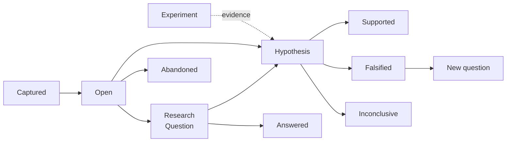

# Research Workspace — Design Brief

2026-09-19 · @Someone

A local-first research workspace organised around questions rather than notes. Eight surfaces, three dashboards, two promotion paths. Specification complete; design not yet started.

## Premise

Obsidian's primary object is the note. Here it is the **question**.

This is a local-first research workspace built on a plain Markdown vault, in the spirit of Obsidian: bidirectional links, graph view, folders, full-text search, plugin-friendly. It differs in what it treats as primary.

Research is driven by open questions, not by documents. Most tools let you store what you've read. Almost none let you track what you still want to know, where the wondering came from, and whether you ever resolved it. This app makes the question a first-class object with its own lifecycle, fed by two inputs: what you read, and what your agents find.

## Platforms and constraints

**Local-first.** The vault is plain files on disk. This app is not the only way to read them.

**Web technology, packaged per device.** One codebase. The dashboards are chart- and table-heavy, which is substantially cheaper in web tooling than in native UI frameworks, and it removes the iPad provisioning problem entirely.

| Device | Packaging | Notes |
| --- | --- | --- |
| Mac | Desktop shell (Electron or Tauri) | The full application: all surfaces, workflows, dashboards. Real window, dock presence, file-system access. |
| iPad | PWA over the local network | Added to the Home Screen: full-screen, own icon, no browser chrome. No provisioning, no sideloading, no developer account. |

### Reading on iPad

Three paths, sequenced by cost. The design does not depend on which is in use.

**Phase 1 — Preview plus ingest.** PDFs live in an iCloud or Dropbox folder. Reading and annotation happen in Preview on iPadOS, which writes standard PDF annotation objects directly into the file with full native pencil fidelity. The Mac app watches the folder and ingests annotations on return. No iPad code, no provisioning, no pencil compromise, and reading works on a plane.

Question capture survives by convention: a highlight whose attached note begins with `Q:` becomes a Question on ingest, with page and quoted passage already attached. Less immediate than a keystroke inside the app, but it preserves the thing that mattered — provenance recorded at the moment of wondering, not reconstructed later.

**Phase 2 — PWA Reader.** The same web app opened full-screen on the iPad over the local network. Capture becomes native and immediate. Costs pencil fidelity, since browser pointer events fall short of PencilKit for sustained handwriting, and only works on the home network.

**Phase 3 — native iPadOS Reader,** if pencil fidelity and true portability both turn out to matter enough to justify a developer account and a second build. Design the Reader so this is a port, not a rewrite.

### Annotation storage

**Annotations are stored in the PDF itself,** as standard annotation objects. This keeps them readable by any PDF tool, is what makes the Preview path possible at all, and fits local-first: the vault is plain files, and annotations travel with the document rather than living in a database beside it.

**A sidecar index supplies stable identity.** PDF annotation objects have no reliable IDs across editors — re-saving from a different app can renumber or rewrite them — but the brief requires that a note be able to link to a *specific* highlight. So the app maintains its own index mapping stable internal IDs to page, rectangle, and quoted text, and re-matches on every ingest.

This matching logic is load-bearing. If it drifts, annotation-level links rot silently, which is worse than failing loudly. Re-match on quoted text first, geometry second, and surface anything that could not be re-matched rather than dropping it.

**Sync scope:** the PDF folder only. Not the vault, not the app database. File-level PDF sync is what iCloud and Dropbox do well, and it avoids the conflict-resolution problem that syncing the whole vault would create.

### Ingest review

Not a surface. Ingest happens when a PDF changes on disk, not when I ask for it: a quiet notification, and a panel that opens only if I choose. Nothing blocking, nothing modal.

**Three kinds of thing arrive, wanting different attention:**

| Arrival | Attention | Why |
| --- | --- | --- |
| New annotations | Low | Confirmation they landed. A count is usually enough. |
| New questions | Medium | Highlights whose note began with `Q:`. Worth a glance — a typo in the convention means a question silently does not exist. |
| Unmatched annotations | High | An annotation that previously had links pointing at it could not be re-identified. This is why the panel exists. |

**Unmatched is the real case.** The annotation moved, was edited, was deleted, or Preview rewrote it — and something I cared about now points at nothing. Resolution needs enough context for a human judgement: the quoted text as it was, the current page context, and what linked to it. Three outcomes: *same annotation, relink*; *gone, drop the links*; *new, treat it as such*.

**Designed against dismissal.** If most ingests are clean and the panel always appears, I will learn to click through it — and then click through the one that mattered. So:

- **No panel at all when everything matched.** A clean ingest is silent beyond a count.
- **Unmatched items persist in Loose Ends** until resolved, rather than living only in a dismissible notification. The notification is a convenience; Loose Ends is the record.

**Sync is deferred.** One machine holds the vault, so phase 1 needs no sync layer and no conflict resolution — the ugliest engineering problem in the original design, removed rather than solved. It returns only if a native iPad app does, at which point it is file-level via iCloud or Dropbox, never a proprietary backend.

**BYOK.** All model access uses the user's own API credentials. No credentials leave the device except to the configured provider.

**Agent output is always a proposal.** Nothing an agent finds enters the vault without explicit acceptance.

## Primary objects

| Object | What it is |
| --- | --- |
| Note | Standard Markdown note with links, tags, backlinks. Familiar Obsidian behavior. |
| Source | A PDF (paper, chapter, slide deck) with highlights and annotations stored alongside. Annotations are individually addressable and linkable, so a note can point at a specific highlight on a specific page. |
| Source stub | A bibliographic record without a file: title, authors, venue, date, link. Created when a Scout proposal is accepted. The PDF is attached later, manually, if the work proves worth reading in full. |
| Question | A lightweight capture, made in two keystrokes from anywhere. Always carries provenance: what you were reading or doing, the page or timestamp, the date. Has a status; tags and links like anything else. |
| Research Question | A promoted Question. Gains structure: working answer, supporting sources, opposing sources, related questions, open threads. A living literature review for one question. |
| Experiment | A run, designed and recorded here but executed elsewhere. Holds purpose, design, links to where it ran, artifacts, and observations. Exists independently of any hypothesis; may become evidence for one. See Part 2. |
| Hypothesis | The other promotion path: a falsifiable claim, tested by evidence rather than answered by reading. Holds N independently resolvable criteria; state is derived from them. See Part 2. |
| Scout | A scheduled background agent that watches one source and proposes what it finds. |

## The question lifecycle

This is the spine of the application.

Capture is deliberately frictionless and carries provenance automatically. Most questions will stay open indefinitely, and that is expected behavior rather than failure. Idle curiosity is the raw material.

**No expiry and no nagging.** Age is a sortable dimension in the Inbox and a called-out category in the Question Map. A small set of older open questions is resurfaced on the home screen, dismissible. There is no badge counting unanswered questions — that turns curiosity into debt and teaches the user to stop opening the Inbox.

## Position history

A cross-cutting mechanism, used by Research Questions and Hypotheses alike. It exists because the app's real subject is **the evolution of thought** — not what I currently believe, but how I came to believe it and what changed my mind.

A Research Question's working answer and a Hypothesis's claim are both *positions held at a time*. Editing one does not overwrite the past; it adds to a history.

**Lightweight by default.** Every revision is recorded automatically: when it changed, and what it changed from. No prompt, no friction, no interruption. Editing is as fast as editing a text field, because a mechanism that slows down writing will simply stop being used.

**Detailed when it matters.** Any revision can carry a *why* — a short note on what prompted the change, optionally linked to the source, annotation, or result responsible. These marked revisions are what the history view leads with; unmarked ones are collapsed into a quiet trail of dates.

The effect: recording the reasoning is optional but rewarded. A question whose answer shifted four times with three explanations reads as a train of thought. One that shifted silently still shows *that* it shifted, which is the minimum worth keeping.

**What a position history gives Part 2 for free:** a falsification criterion is simply a position recorded before the results arrived. Its timestamp is what makes later revision visible rather than silent — see Part 2.

## Surfaces

**Home.** Today's state at a glance: queue depth, recent vault activity, a few resurfaced stale questions, any broken Scouts. Light by design. The three dashboards are opened deliberately from here.

**Question Inbox.** Everything captured recently, newest first, each showing its origin. Sortable by age. Triage: promote to Research Question, promote to Hypothesis, link, answer, or drop.

**Reader.** PDF viewer with highlighting and margin annotation, built for tablet use. Selecting text offers "make a note," "make a question," or "link to existing." Reading position, highlights, and annotations sync across devices.

**Research Question view.** The structured page: claim, evidence for, evidence against, sources, open sub-questions, position history.

**Hypothesis view.** The claim, its criteria and their outcomes, evidence links per criterion, derived state, and position history. Specified in Part 2.

**Experiment view.** Purpose, design, links to where it ran, artifacts, observations, and status — plus an inbox of completed runs not yet interpreted. Specified in Part 2.

**Scout Queue.** Proposals awaiting triage. Detailed below.

**Vault.** The ordinary note-taking surface, plus graph view.

## Scouts

A Scout watches one source on a cadence and proposes what it finds. Every Scout has three parts.

1. **A source.** Either a *watched source* (a lab's publications page, a researcher's blog, a conference or journal proceedings index, an RSS/Atom feed) or a *structured source* (a query against Semantic Scholar, arXiv, OpenAlex, PubMed, or Crossref).
2. **A filter.** Optional. Either a topic or a link to one or more open questions. With no filter, everything new from that source is proposed.
3. **A cadence.** How often it checks, from daily to monthly.

| Scout | Source | Filter | Cadence |
| --- | --- | --- | --- |
| Anthropic Alignment output | Lab publications page | None | Weekly |
| Journal X on topic Y | Proceedings index | Topic: Y | Monthly |
| Blogger Z | Blog feed | None | Daily |
| Open questions sweep | Semantic Scholar + arXiv | Open questions | Weekly |

### Proposals

A proposal is a metadata card, populated from the source itself: title, authors, publication date, venue, author-supplied keywords, abstract or summary as published, link back, and origin (which Scout found it, which question it matched).

No model-generated summary. No file download. Fields that cannot be extracted show as missing rather than guessed — a blog post with no venue or keyword list is still a valid card.

Structured sources return these fields directly. Watched sources require extraction from pages not designed to give them up cleanly, which is the one place in the Scout pipeline a model call earns its keep.

### Deduplication

The same work will legitimately surface from several Scouts: a preprint on arXiv, the lab's own announcement, the eventual journal record. These merge into one card showing everywhere it appeared, most complete metadata winning. Corroboration count is retained as a ranking signal.

### Source health

Watched sources break silently when a site changes layout. A Scout that has quietly stopped finding things looks identical to a quiet field, which makes this the most dangerous failure mode in the system. Each Scout tracks:

- **Last successful extraction** — when it last parsed the source cleanly
- **Last new item** — when it last found something; may be much older, and that is fine
- **Structure change detected** — flagged when the page's shape shifts enough to drop extraction confidence, or when a reliably productive source goes unusually quiet

Health is visible per-Scout in the Scout Activity dashboard, and broken Scouts surface on the home screen.

### Retroactive briefing

New questions are picked up by existing Scouts on their next scheduled run.

A backward search against already-published work is offered but never required, with a configurable backstop date (global default, adjustable per search). Retroactive results are tagged as such in the queue, so they stay distinguishable from ongoing finds and can be triaged or dismissed as a batch.

## Scout Queue

Designed for volume. In an active field a week's proposals may run to dozens or hundreds. The queue's job is to reduce what needs looking at and make each look fast.

**Two lanes, assigned per proposal.** The lane reflects relevance to the user's work, which the Scout cannot know in advance — an unfiltered lab Scout will legitimately produce both kinds.

- **Review** — applicable to the work. A queue: items sit until triaged, and accept/reject is meaningful.
- **Skim** — worth clocking, not necessarily a permanent addition. A feed: scrolling past is the whole interaction. Nothing in Skim requires clearing, and items age out on their own.

**How the lane is assigned.** The Scout sets a starting lane as a prior — a question-briefed sweep defaults to Review, an unfiltered blog or lab watch defaults to Skim. Ranking signals then promote individual items up into Review when they score high on question-match, which catches the important exception: the blogger who posts something that actually matters.

**Demotion, too.** Review items skipped repeatedly, or aged past the window unactioned, drop to Skim rather than accumulating as debt. This keeps the Review count honest and the home screen number meaningful.

Lanes govern attention, not capability. Anything in Skim can be promoted to a Source stub through the same path as anything else.

**Corroboration crosses lanes.** When dedup merges a blog announcement, a preprint, and a proceedings record, the merged card lands in the highest-attention lane any component reached.

**Grouping.** Within a lane, proposals group by Scout, by matched question, or by topic cluster. Grouping keeps triage in one mental context at a time.

**Ranking within a group,** from signals already in the vault, requiring no additional model calls:

- Author overlap with previously accepted work
- Venue acceptance history
- Keyword overlap with open questions
- Corroboration count across Scouts

Ranking is a default sort, never a filter. Nothing is hidden by it.

**Counterweight slot.** Ranking on accept history in a popular field narrows what the user sees toward what they already read. Each run reserves a small "outside the usual" slot: well-corroborated work from authors and venues with no acceptance history. Cheap to implement, and the alternative is a slow drift into one corner of the field.

**Fast triage.** Keyboard-driven, one card at a time: accept, reject, defer, next. Each card leads with why it is here.

**Bulk actions.** Reject a whole group. Reject everything from one Scout's run. Bulk-defer.

**Per-run caps.** Optional per Scout: propose only the top N by rank, keeping a prolific source from flooding the queue.

**Muting over auto-rejecting.** Rules (author, venue, keyword) move proposals to a muted view rather than discarding them. Muted items stay searchable and countable, so a rule that is quietly wrong can be caught.

**Queue aging.** Proposals past a configurable window collapse into a digest. Still accessible, no longer demanding.

Accepting creates a Source stub linked to the originating question. Rejecting feeds the Scout's accept-rate metric. Accept rate is a Review-only measure. Skim items are never explicitly rejected — they age out — so they carry no signal at all, and including them would dilute the metric with volume. Judging a Scout on its Review output measures useful yield rather than raw yield, which is the better question anyway.

## Dashboards

Three surfaces, each answering a distinct question with a distinct visit rhythm. Every element clicks through to the underlying objects, and every metric implies an action. No counters that exist only to be looked at.

| Dashboard | Question it answers | Nature |
| --- | --- | --- |
| Question Map | Where is my work thin, and where am I relative to the field? | Analytical — visited when thinking |
| Scout Activity | Are my agents earning their keep? | Operational — visited when tuning |
| Loose Ends | What is incomplete or broken? | Maintenance — visited when tidying |

Three is the starting set, not a ceiling. More dashboards may be added when a genuine question emerges that none of these answers — but each new one must pass the same test: a distinct question, a distinct visit rhythm, and every element leading to an action. A dashboard that exists to display accumulation does not qualify.

### Loose Ends — what is incomplete or broken

One place where everything unfinished surfaces, so none of it has to be remembered. Maintenance, not statistics. Ideally usually short: a five-minute visit, not a review session.

**Why this replaced a Vault Overview.** An earlier draft had a dashboard showing growth over time, topic clusters sized by content, and recent activity. Run against the rule that every metric implies an action, half of it failed: a chart of notes-added-per-week changes nothing, and a cooling topic cluster usually means the topic finished rather than stalled. What survived — orphans, stubs, unread sources — was all one thing: *what in my vault is incomplete*. That is this surface. Accumulation statistics were cut, not relocated.

**Broken plumbing** — failing right now, and the only items that worsen while ignored. Top of the screen.

- Scouts whose source stopped parsing cleanly
- Scouts whose last successful extraction is stale
- Annotations that could not be re-matched on ingest, shown with their quoted text so the mismatch can be judged

**Unfinished reading**

- Source stubs with no PDF attached, oldest first
- PDFs attached but never annotated
- Papers accepted from the Scout Queue weeks ago with nothing attached since

**Disconnected material**

- Orphan notes: no links in or out
- Stubs: notes that never grew past a line or two
- Sources with annotations but no note or question linking to them — read, but nothing came of it

**Stalled questions**

- Research Questions promoted but never given a source
- Questions whose working answer has not changed in months while sources kept arriving
- Hypotheses sitting inconclusive with criteria still unresolved
- Experiments complete with artifacts but no observations recorded
- Linked heavyweight artifacts whose target has gone missing

**What keeps it useful rather than accusing:**

- Every row has a one-click resolution: attach, link, dismiss, or **mark deliberate**. The last is essential — an orphan note that is meant to be orphaned must be dismissible permanently, or the list fills with noise and stops being opened.
- Counts per group, never a total. A single "47 loose ends" figure turns maintenance into debt, which this design avoids everywhere else.
- Empty groups collapse rather than showing a cheerful zero state.

**Deliberately excluded:** growth charts, cluster maps, activity feeds, anything answering "how much have I accumulated." If a number does not name something fixable, it does not belong here.

**Overlap with Home is intentional.** Home shows *that* a Scout broke; Loose Ends is where it gets fixed. Keep the duplication explicit so it does not drift into two half-versions of the same list.

**Boundary with the Question Map:** "unquestioned knowledge" is analytical and stays on the Map; "orphan notes" is a defect and lives here. The test is whether the item names something broken or something merely worth knowing.

### Scout Activity — are my agents earning their keep

- Per-Scout: last run, cadence, filter, source health, candidates proposed
- Accept rate over time per Scout, measured on Review items only, with the filter editable directly from this screen
- Review queue depth and age, counted separately from Skim volume
- Cost and token spend per Scout, per-run, since proposals themselves are near-free
- Coverage gaps: open questions no Scout is currently briefed on

### Question Map

A page, not a single view. It answers two different things with two different data sources, and they should not be merged into one picture.

**Panel 1 — Coverage matrix (endogenous).** Where is my own work thin? Computed entirely from the vault; free and instant.

Questions as rows, tags as columns, cell intensity showing how much material attaches. Both axes sorted by total weight, so structure emerges: densely-supported questions rise, empty rows are the backlog, empty columns are unquestioned knowledge. Falls back to ranked lists past roughly 40 questions, which is the form that actually scales.

Four readings come out of the same panel:

- **Well-supported questions** — enough material to possibly answer or promote
- **Unanchored questions** — open, aging, nothing attached. The real backlog.
- **Unquestioned knowledge** — tags no open question points at. Either settled, or a sign of collecting without asking.
- **Clocked but unquestioned** — Skim items pulled into the vault with no question behind them. The strongest evidence of an unarticulated interest, and often where the next research question comes from.

**What counts as an edge:** explicit links only — sources and annotations attached to a question. Inferred connections (shared tags, keyword overlap, notes that merely mention it) are available as a visually lighter toggleable layer, off by default. If inferred edges counted toward support, almost nothing would read as unanchored — a question sharing a tag with forty papers would look well-covered despite never having been connected to any of them. That would destroy the most useful thing on the page.

**The inferred layer is an action, not a view.** Rather than showing faint edges to look at, it offers candidate links for review: *these six papers share tags with this unanchored question — link any?* Accepting creates a real explicit edge; declining suppresses that pairing. The same computation becomes a promotion path for the backlog instead of decoration, and every accepted link is a vote that improves later suggestions.

**Panel 2 — Attention scatter (exogenous).** Where am I relative to the field? Requires literature-API data, synced in the background, with an "as of" indicator.

Field growth rate on one axis, my own coverage on the other. Point size = my paper count for that tag. Quadrants labeled, because an unlabeled quadrant chart is just dots:

|  | Low field attention | High field attention |
| --- | --- | --- |
| **High my coverage** | Ahead of the field, or a backwater | Crowded area — expect competition and Scout volume |
| **Low my coverage** | Genuinely obscure — opportunity or dead end | **Blind spot.** The most actionable quadrant. |

**Measure:** growth rate of publication volume, not absolute citation count. Raw citations are field- and age-dependent, so a 2019 paper with 200 and a 2026 paper with 12 may be equally hot. Growth rate is also the measure that implies an action — an accelerating topic is a topic to move into.

**Panels 3 and 4 — Flow and provenance.** Question flow over time (captured → promoted → answered or abandoned) as a funnel, and a ranked list of which sources and contexts generate the most questions. Distinct panels; neither is a map.

#### Tags as topics

Tags are the topic axis for both panels. Slash-separated and parsed into a tree, Obsidian-style: `ml/interpretability/probing`. Coverage rolls up — a parent's coverage is the union of its children's — so the matrix and scatter can be viewed at any depth.

**A depth control is required on the scatter.** Mixing a parent and its own children on one chart double-counts coverage and makes the quadrants meaningless.

**Out of scope:** tag hierarchy management (tree editor, rename-with-descendants, merge tools). Slash-parsing gets everything above; the rest is a separate feature.

#### The tag lexicon

Field attention is measured per tag against a keyword set, built automatically from accept history. Every accepted paper is a vote linking one of my tags to the author-supplied keywords it carries; a tag's lexicon is the keywords that co-occur with it, weighted by frequency. No configuration screen.

**Flat, not inherited.** Each tag that is actually used earns its own lexicon at whatever level has enough papers to support one. A leaf must not inherit its parent's keywords: growth rate for `interpretability` says nothing about `probing`, and the whole point of a narrow tag is that it moves differently. A leaf showing its parent's growth rate under its own name is worse than showing nothing.

**Unplaced is not low.** A tag with no lexicon yet appears as unplaced, never as low-attention — those look identical on a chart and mean opposite things. It still contributes to its parent's position, so zooming out reveals it. Manual seeding is possible: point a tag at a few papers, or type the keywords directly.

**The lexicon is visible and editable.** Each tag shows what it is measured as. A tag quietly attached to the wrong keywords makes every number downstream wrong with no way to tell from the chart.

**Show the paper count behind every point,** so a tag with three papers is not read with the same confidence as one with ninety.

**Visual caution:** none of this is a force-directed graph. That is Obsidian's graph-view failure mode — impressive and uninformative. Sorted matrix, labeled scatter, ranked lists.

## Testing: Hypothesis and Experiment

The second promotion path, for questions answered by testing rather than reading. Everything above concerns finding and reading; this section covers the testing half. The two share the Question lifecycle, position history, and the vault.

### Scope: the argument, not the execution

This app does not run experiments, track runs, or store results data. Experiments here are computational and analytical, and that domain already has good tooling — W&B, MLflow, notebooks, a directory of outputs. Rebuilding it would produce something worse.

What those tools do not hold is the reasoning: what am I actually claiming, what would disprove it, did the result change my mind. That gets lost in a scroll of run IDs, and it is exactly what this app owns. A Hypothesis links out to where runs live and records what they meant.

**Why the discipline matters more here, not less.** With physical experiments, cost enforces rigor — six runs means planning carefully. Computational runs are cheap, so the risk shifts from bad design to post-hoc storytelling: run two hundred sweeps, then narrate whichever result looks best. The valuable artifact is therefore not a variables-and-controls form. It is a timestamped record of what was predicted before anyone looked.

### Hypothesis vs Research Question

Both are claims with position histories. They differ in **falsifiability**: a Research Question is open-ended ("how do people approach X"), a Hypothesis is a specific claim that could be shown false.

Most hypotheses should start as Research Questions and sharpen into claims. Promotion along that path is supported and is the expected route; direct promotion from a captured Question is also allowed.

### What a Hypothesis holds

**The claim** — a falsifiable statement, with full position history. Promoted hypotheses carry the original wondering and its provenance along with them.

**Criteria** — a list, each independently resolvable. Each records its own outcome: met, not met, or inconclusive. Each also declares its relationship to the claim:

| Relationship | Meaning |
| --- | --- |
| Confirming | Met supports the claim |
| Falsifying | Met kills the claim, regardless of other criteria |
| Diagnostic | Informative, but does not decide |

The diagnostic type is the escape valve that stops sanity checks from being mislabeled as tests.

**Design notes** — what is varied, what is held constant, known confounds. Deliberately lighter than a formal DOE matrix: for computational work the real decisions are usually "which sweep, over what range, measured how," which is a paragraph.

**Evidence** — links out to where runs live (a W&B project, a results directory, a notebook, a commit), attached *per criterion*, each with a short note on what it showed. The app stores the interpretation, never the data.

### The falsification commitment

Criteria are recorded **before** results arrive. They are not locked — honest research sometimes requires revision — but they are versioned more loudly than anything else in the app. A criterion changed after evidence exists is conspicuous in the position history and stays conspicuous.

### Derived state, not declared

The hypothesis's state is computed from its criteria rather than chosen from a menu:

- All criteria met → **supported**
- Any falsifying criterion met → **falsified**, regardless of the others
- Mixed or unresolved → **inconclusive**

**Inconclusive is the default and a first-class outcome.** With cheap computational runs it is the most common honest result, and the one most likely to be quietly narrated into "supported."

Overriding inconclusive to supported is permitted, but requires a written justification that lands in the position history. This does not forbid concluding on partial evidence — sometimes that is correct — it makes the partiality permanent and visible. Six months later it is still legible that the call was made with two of four criteria met, and why.

**Falsified is a result, not a failure.** It is as visible and as linkable as supported, and it answers the originating Question with a real answer: no.

### Closing the loop

A resolved Hypothesis writes back to the Question it came from. Falsification in particular tends to spawn the next question, which is usually the more interesting one, so the handoff is designed rather than left as a dead end: resolving a hypothesis offers to capture the follow-up question, pre-linked to the result that prompted it.

### Experiment

An Experiment exists **independently of any hypothesis**. Things get run to see what happens, before it is clear what claim they bear on, and some never attach to one. An experiment that produced an interesting surprise unrelated to any current hypothesis still needs somewhere to live — it is the experimental counterpart of a captured Question.

This produces a symmetry across the two halves of the app:

| Reading side | Testing side |
| --- | --- |
| Question — noticed, may never be pursued | Experiment — run, may never bear on a claim |
| Research Question — promoted, structured | Hypothesis — promoted, falsifiable |
| Source — evidence, attaches to questions | Experiment — evidence, attaches to criteria |

Like a Source, an Experiment has a dual role: it is an object in its own right, and a potential piece of evidence. A paper exists whether or not any question cites it; so does a run.

**Why this is an object and not just evidence.** An earlier draft collapsed Experiment into Hypothesis, on the reasoning that an app which executes nothing has no execution lifecycle to model, leaving the criterion as the resolvable unit. That was wrong for one reason: experiments exist *before* they bear on a claim. A run that produced an interesting surprise unrelated to any current hypothesis had nowhere to live, and evidence-attached-to-a-criterion presupposes the criterion. The independent object also solves a duplication problem — one run speaking to three criteria is recorded once and referenced three times, rather than pasted in three places with no record that they were one act.

**What an Experiment holds:**

- **Purpose** — what I am trying to find out. Often looser than a claim: "see whether X matters at all."
- **Design** — what is varied, what is held, conditions, how it is measured. Written before running, with position history, so changes to the design are visible.
- **Where it ran** — links out to code, config, commit, W&B project, results directory. The app never executes anything.
- **Artifacts** — screenshots, plots, data snippets, sample outputs, small tables. See storage below.
- **Observations** — what was seen, with position history, because interpretation changes.
- **Status** — planned, running, complete, abandoned. Maintained by hand; the app does not drive it.

**Promotion to evidence is a separate act.** Attaching an Experiment to a Hypothesis criterion carries its own note on what it shows *for that criterion*. One Experiment can attach to several criteria across several hypotheses, so a single run that speaks to accuracy, latency, and the held-out set is recorded once and referenced three times.

### Artifact storage

Experiment artifacts are the first content in the vault that is neither text I wrote nor a PDF I acquired. They do not exist anywhere else, so losing them loses the result.

**Small files are stored in the vault**, beside the experiment's note, as ordinary files on disk: screenshots, plots, CSV snippets, sample outputs. This keeps the vault self-contained and portable, and keeps the local-first promise intact.

**Heavyweight artifacts are linked, not stored** — model checkpoints, full datasets, large result dumps. A link plus enough metadata to find it again: path or URL, size, date, and what it contains.

A size threshold governs which path applies, with the choice always overridable per artifact. The app should warn rather than silently link, since an artifact that lives outside the vault can disappear without the vault noticing.

### Experiment surface

Experiments get their own surface, plus an inbox — the experimental counterpart to the Question Inbox, holding completed runs not yet interpreted or attached to anything.

This makes seven surfaces rather than six.

## Open questions

Live decisions, deliberately unresolved. Most want a first design pass before being settled.

**Does the Question Map hold together as one page?** It is four panels sharing a name rather than a visualization, and two of them draw on entirely different data sources. The risk is four unrelated widgets stacked vertically. Three possible resolutions, none chosen:

- One panel leads and the others become secondary — probably the coverage matrix
- The attention scatter becomes its own dashboard, breaking the three-dashboard symmetry but making each more coherent
- The flow funnel gets cut

**Does the flow funnel earn its place?** Captured → promoted → answered is a statistic about process, not something to act on. It may fail the same test that removed the growth charts from Vault Overview.

**Does the reading path hold after real use?** Phase 1 is Preview plus ingest, chosen over a PWA Reader and a native app. Settled on prior experience with Preview, but the annotation re-matching logic is unproven and the `Q:` convention has not been lived with.

**How large is "small"?** The artifact size threshold that decides stored-in-vault versus linked is unset. Wants a real number after seeing what typical artifacts weigh.

**Is the Hypothesis / Research Question line clean in practice?** Falsifiability is the stated distinction. Analytical work sits near the boundary, and the risk is two half-used objects that both mean "a thing I am investigating."

## Handing this to Claude Design

Eleven prompts live on the **Design prompts** tab, ordered for a single fresh session: the shape, then eight surfaces, then three dashboards.

The brief is deliberately exhaustive and should not be pasted whole. The prompts are the delivery mechanism; this document is the reference behind them.

Two sections are most likely to come back generic and are worth defending hardest: the **Scout Queue**, which wants to become an email client, and the **Question Map**, which wants to become a force-directed graph. Both have enough specific mechanics to justify their own passes.
